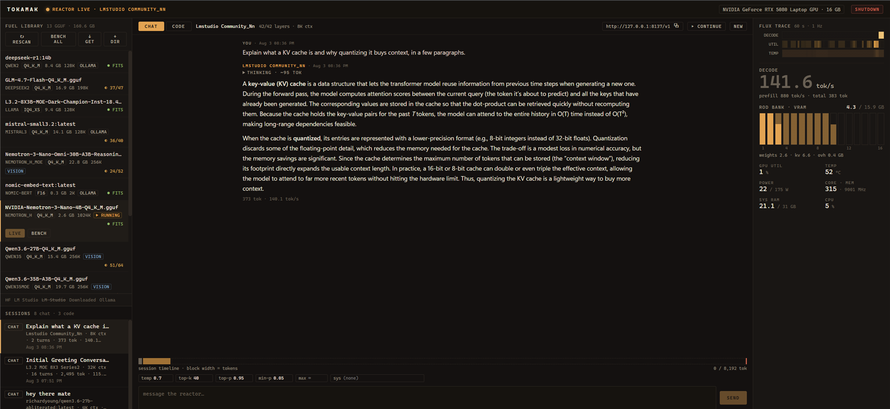
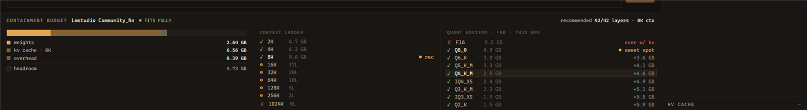
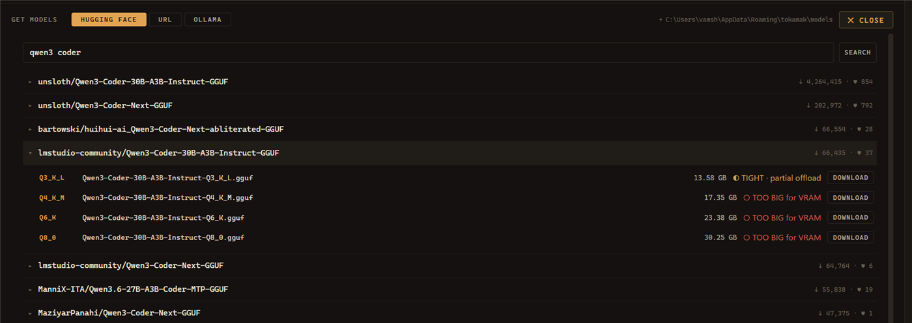

# Tokamak

**The local LLM app that shows its work.**

Know what fits on your GPU before you download it.

[](https://github.com/360NoScopeGuru/tokamak/releases/latest)
[](https://github.com/360NoScopeGuru/tokamak/actions)
[](LICENSE)
[](#install)



Tokamak is a desktop app for people who run large language models on their own hardware and want to actually see and control what is happening. It finds the GGUF models you already have, works out the best way to run each one on your GPU, launches them through llama.cpp, and turns the whole thing into a live instrument panel: VRAM, utilization, temperature, power, tokens per second, and KV cache pressure, all animated in real time.

A tokamak is the machine that holds a fusion reaction inside a magnetic ring. That is roughly the job here: contain a model that wants all of your VRAM, keep it stable, and get useful work out of it. The name also happens to start with "tok", which is the only unit anyone here cares about.

> Status: v0.1.3. Windows and Linux, NVIDIA first. Built with Tauri 2 (Rust) and React.

---

## Install

**[⬇ Download the latest installer](https://github.com/360NoScopeGuru/tokamak/releases/latest)** — no Rust, no Node, no toolchain. Installers are built by CI on every tagged version.

| | |
|---|---|
| **Windows** | Run the `.msi`, or the `.exe` setup. Windows will warn that the publisher is unknown, because the build is unsigned: choose **More info → Run anyway** |
| **Linux** | `.AppImage` — `chmod +x Tokamak_*.AppImage` and run it, nothing to install. Or `.deb` (`sudo apt install ./Tokamak_*.deb`) or `.rpm` (`sudo dnf install ./Tokamak-*.rpm`). Built on Ubuntu 22.04, so it wants 22.04 or an equivalently recent distribution |

The AppImage is roughly fifteen times the size of the `.deb`/`.rpm` because it
carries its own WebKitGTK runtime; the distribution packages link against the
one you already have.

### What you also need

| | |
|---|---|
| **GPU** | NVIDIA, for telemetry and benchmarking — both read NVML |
| **Inference runtime** | None. On first run Tokamak offers to fetch the right llama.cpp build for your GPU and manages it itself. If you already have LM Studio or llama.cpp, it uses those instead |
| **Models** | Optional. Tokamak reads your existing Hugging Face / LM Studio / Ollama caches, and can download new ones itself |

One caveat worth stating plainly: **on Linux the runtime Tokamak fetches is
Vulkan or CPU**, because llama.cpp publishes no prebuilt CUDA build for Linux.
NVIDIA users who want CUDA should install their distribution's CUDA-enabled
`llama.cpp` — Tokamak finds it on `PATH` and prefers it. Windows gets CUDA
directly.

<details>
<summary><b>Building from source instead</b></summary>

Needs Rust (stable) and Node.js 20+.

On Linux, also the Tauri v2 system libraries:

```bash
sudo apt-get install -y libwebkit2gtk-4.1-dev libappindicator3-dev \
  librsvg2-dev libxdo-dev libssl-dev patchelf
```

Then, on either platform:

```bash
git clone https://github.com/360NoScopeGuru/tokamak
cd tokamak
npm install
npm run tauri dev      # run in development
npm run tauri build    # build a release
```

Tests:

```bash
cd src-tauri
cargo test                            # unit tests
cargo test -- --ignored --nocapture   # hardware tests (launch real models)
```

</details>

---

## Why this exists

Ollama and LM Studio are fine chat apps, but they treat your hardware as a black box:

- They will not tell you *why* a model runs at 4 tok/s instead of 190.
- They guess at GPU offload settings and never show you the math.
- They cannot tell you which quantization of a model you *should have downloaded* for your GPU.
- Their idea of telemetry is a spinner.

Tokamak is built around three ideas:

1. **No lock-in.** It reads the model caches you already have (Hugging Face, LM Studio, any folder you add). Plain GGUF files, no proprietary blob store, no re-downloading. It even drives the llama.cpp server binaries LM Studio already installed.
2. **Measure, don't guess.** The estimator predicts what fits, and the benchmark then *actually runs the model* and reports real numbers from your GPU. Recommendations are grounded in arithmetic you can inspect, then verified by measurement.
3. **Show everything.** If the KV cache is about to overflow, you should see it coming. If half the layers spilled to CPU, the decode-rate cliff should be visible, not mysterious.

---

## Features

| | |
|---|---|
| **Model library** | Reads the caches you already have — Hugging Face, LM Studio, Ollama — plus any folder you add. Plain GGUF, no proprietary store |
| **Download models in-app** | Search Hugging Face, paste a URL, or drive `ollama pull` — with a fit verdict *before* you download |
| **Hardware-aware auto-config** | Computes GPU layers and context from the model's real attention shape, and shows the arithmetic |
| **Quant advisor** | Which quant you *should have downloaded* for this GPU |
| **KV cache quantization** | f16 / q8_0 / q4_0 — roughly double the context for the same VRAM |
| **Live telemetry** | VRAM as fuel rods, 60 s flux trace, KV containment alert |
| **Chat + agent tabs** | Separate transcripts; the agent gets sandboxed workspace tools behind an approval gate |
| **Sessions** | Every turn persisted with full detail, named by the model, in plain JSON |
| **Measured benchmarks** | Actually runs the model and reports real numbers |

<details>
<summary><b>The quant advisor and context ladder</b></summary>



The VRAM budget broken into weights / KV cache / overhead / headroom, a context
ladder showing how many layers fit at each context size, and the whole GGUF
quant ladder judged against your card with the sweet spot marked.

Bigger context costs GPU layers — the ladder makes that trade explicit instead
of leaving you to guess.

</details>

<details>
<summary><b>Downloading models, with fit shown first</b></summary>



Search Hugging Face from inside the app. Every quant in a repo is listed with
its size and a verdict for *your* GPU, so you find out a 17 GB file will not
fit **before** downloading it rather than after.

Downloads resume if interrupted, and land as plain `.gguf` files in a folder
the scanner already watches.

</details>

<details>
<summary><b>Agent mode</b></summary>

A CODE tab separate from CHAT. The model gets four workspace-sandboxed tools:
`list_dir` and `read_file` run automatically, `write_file` and `run_command`
stop at an APPROVE / DENY card.

The sandbox is enforced in Rust with lexical and canonical path checks, unit
tested against traversal. If the model stops early mid-task — which llama.cpp
reports as an ordinary completion — the agent notices and pushes it to
continue instead of quitting silently.

</details>

## Architecture

<details>
<summary>How it fits together</summary>

```
src-tauri/src/
  gguf.rs        GGUF v2/v3 header parser (metadata KV block, quant labels,
                 attention geometry, split-file fields)
  scanner.rs     cache discovery: HF hub, LM Studio, user folders; shard and
                 mmproj detection
  telemetry.rs   NVML GPU metrics + sysinfo RAM/CPU in long-lived managed state
  estimator.rs   VRAM fit arithmetic, context ladder, quant advisor
  llama.rs       llama-server process manager: binary discovery and ranking,
                 vendor DLL path injection, health probing, Prometheus /metrics
                 parsing, kill-on-drop process hygiene
  benchmark.rs   measured benchmark runner + Markdown report export
  chat.rs        SSE streaming chat client on a worker thread, reasoning aware
  tools.rs       agent tools (list/read/write/run), sandboxed to the workspace
  settings.rs    persisted JSON settings (folders, binary, UI scale, workspace)
  lib.rs         Tauri commands wiring it all together

src/
  App.tsx        orchestration, polling, launch/bench/suite flows, UI scaling
  Library.tsx    fuel library with fit verdicts
  Rail.tsx       telemetry stack: flux trace, rod bank, vitals, KV alert
  Flux.tsx       the 60 second canvas heat strips
  Dock.tsx       containment budget, context ladder, quant advisor, bench detail
  Console.tsx    streaming chat, markdown rendering, agent loop + approvals
  Markdown.tsx   safe markdown to React renderer for model output
  styles.css     "Control Rod" design system
```

Design notes:

- **One server at a time** in v1. Starting a model replaces the previous one; benchmarks run on their own port (8139) and never touch your session on 8137.
- **Process hygiene matters.** The server manager kills its child on drop, so a crash, a panicking test, or closing the app never leaves an orphaned `llama-server` squatting on your VRAM.
- **All HTTP lives in Rust.** The webview never talks to the model server directly, which avoids CORS entirely and keeps one code path for streaming, health, and metrics.

</details>

## Roadmap

Revision letters match the [landing page](https://360noscopeguru.github.io/tokamak/)'s
revision block, so the two never drift apart again.

Shipped:

- **Rev A** — model library across Hugging Face, LM Studio and Ollama caches, GGUF parsing, fit verdicts
- **Rev B** — hardware-aware auto-config, context ladder, quant advisor, measured benchmarks
- **Rev C** — live telemetry cockpit: rod bank, flux trace, KV containment alert
- **Rev D** — chat and agent tabs, sandboxed workspace tools, full session history
- **Rev E** — in-app model downloads and a managed `llama.cpp` runtime, so LM Studio is not a prerequisite

Ahead:

- **Rev F** *(in progress)* — speculative decoding: the draft picker, its compatibility checks and VRAM budgeting ship in v0.1.3; a live accept-rate display in the cockpit is still to come
- **Rev G** — conversation branching: fork at any message, compare branches side by side
- **Rev H** — LoRA hot-swap, multi-GPU tensor-parallel control, local quant conversion

Also wanted, unscheduled: sampler presets and per-message settings provenance
(the sampler parameters are already plumbed through, but there is nothing that
saves a named preset or records which settings produced a given reply).

## License

[Mozilla Public License 2.0](LICENSE).

File-level copyleft: if you modify Tokamak's own source files and distribute
the result, those files stay open. You are free to combine it with proprietary
code, ship it commercially, and build on it — what you cannot do is take the
improvements private.

It is the middle ground between MIT (anyone may close it) and GPL (everything
touching it must open), and it matches what this project claims to be.
